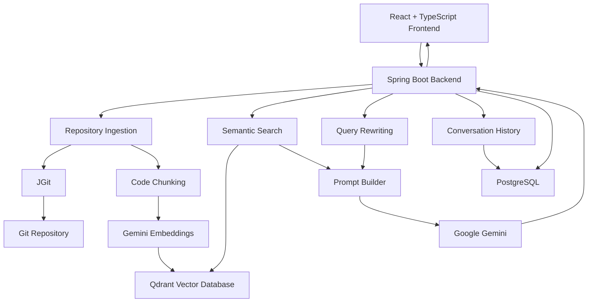

<div align="center">

# CodePilot AI

### AI-Powered Codebase Assistant

Chat with your Git repositories using Retrieval-Augmented Generation (RAG),
Google Gemini, Spring AI, and Qdrant.

[](https://www.oracle.com/java/)
[](https://spring.io/projects/spring-boot)
[](https://spring.io/projects/spring-ai)
[](https://www.postgresql.org/)
[](https://qdrant.tech/)
[](https://www.docker.com/)
[](https://react.dev/)

**Backend:** [codepilot-ai](https://github.com/sriram175/codepilot-ai)  
**Frontend:** [codepilot-ai-ui](https://github.com/sriram175/codepilot-ai-ui)

</div>

> **Status:** Active development · Backend + Frontend available · Dockerized local setup

---

## Overview

CodePilot AI is an AI-powered codebase assistant that allows developers to interact with Git repositories using natural language.

Instead of manually searching through source files, CodePilot AI ingests a repository, generates vector embeddings for its code, stores those embeddings in Qdrant, and retrieves relevant code when a developer asks a question.

The retrieved context is combined with repository information, conversation history, and the user's question before being sent to Google Gemini, enabling contextual answers grounded in the repository.

### Example questions

```text
What is the main purpose of this project?

How does the authentication flow work?

Where is repository ingestion implemented?

Explain how the application connects to Qdrant.

What happens when a user asks a follow-up question?
```

---

## Quick Start

### Prerequisites

Install the following before starting:

- Java 17
- Maven
- Docker Desktop
- Node.js and npm
- Google Gemini API key

### 1. Clone the repositories

Backend:

```bash
git clone https://github.com/sriram175/codepilot-ai.git
cd codepilot-ai
```

Frontend:

```bash
git clone https://github.com/sriram175/codepilot-ai-ui.git
cd codepilot-ai-ui
```

### 2. Configure environment variables

Create a `.env` file in the backend project directory:

```properties
POSTGRES_PASSWORD=your_postgres_password
GOOGLE_API_KEY=your_google_gemini_api_key
FRONTEND_URL=http://localhost:5173
```

> Never commit `.env` or API keys to source control.

### 3. Build the backend

Windows:

```powershell
.\mvnw clean package
```

Linux/macOS:

```bash
./mvnw clean package
```

### 4. Start the backend

```bash
docker compose up --build
```

### 5. Start the frontend

From the frontend project:

```bash
npm install
npm run dev
```

Open:

```text
http://localhost:5173
```

The backend will be available at:

```text
http://localhost:8080
```

---

# Key Features

- Git repository ingestion using JGit
- Repository snapshot generation
- AI-generated repository summaries
- Code chunking and embedding generation
- Semantic search using Qdrant
- Retrieval-Augmented Generation (RAG)
- Context-aware conversational chat
- Conversation history
- Query rewriting for follow-up questions
- Repository source attribution
- PostgreSQL persistence
- Google Gemini integration
- Dockerized backend infrastructure
- React + TypeScript frontend

---

# Architecture



---

# How It Works

CodePilot AI follows a Retrieval-Augmented Generation pipeline.

## 1. Repository Ingestion

A Git repository URL is submitted to the backend.

```text
Git Repository
      │
      ▼
     JGit
      │
      ▼
Repository Snapshot
      │
      ▼
 Code Chunking
      │
      ▼
Embedding Generation
      │
      ▼
    Qdrant
```

The repository is processed and relevant source files are converted into searchable chunks.

---

## 2. Repository Summary

CodePilot generates a high-level repository summary containing information such as:

- Project purpose
- Technology stack
- Main modules
- Architecture
- Key components
- Data flow
- External integrations
- Suggestions for improvement

The generated summary can then be used as additional context when answering questions about the repository.

---

## 3. User Question

The user asks a natural-language question through the frontend.

Example:

```text
How does repository ingestion work?
```

---

## 4. Query Rewriting

For follow-up questions, CodePilot can use previous conversation messages to rewrite the user's question into a more complete search query.

Example:

```text
User:
How does authentication work?

Follow-up:
What about JWT?
```

The follow-up can be rewritten using conversation context before semantic search.

---

## 5. Semantic Search

The question is converted into an embedding and used to search Qdrant.

```text
User Question
      │
      ▼
Query Embedding
      │
      ▼
Qdrant Similarity Search
      │
      ▼
Relevant Code Chunks
```

Only the most relevant repository content is passed into the generation stage.

---

## 6. Prompt Construction

The final prompt combines relevant context such as:

- Conversation history
- Repository summary
- Retrieved source code
- Original user question

This provides Gemini with repository-specific context before generating the answer.

---

## 7. AI Response

Google Gemini generates the final response.

The backend returns the answer together with source information for the relevant repository files.

```text
Question
   │
   ▼
Query Rewrite
   │
   ▼
Semantic Search
   │
   ▼
Relevant Code
   │
   ▼
Prompt Construction
   │
   ▼
Google Gemini
   │
   ▼
Answer + Sources
```

---

# Technology Stack

## Backend

| Technology | Purpose |
|---|---|
| Java 17 | Backend development |
| Spring Boot 3.5.5 | Application framework |
| Spring AI 1.1.1 | AI integration |
| Spring Data JPA | Persistence |
| Hibernate | ORM |
| Maven | Build and dependency management |

## AI & RAG

| Technology | Purpose |
|---|---|
| Google Gemini | LLM-based response generation |
| Gemini Embeddings | Vector representation generation |
| Spring AI | AI abstraction and integration |
| Qdrant | Vector storage and similarity search |

## Repository Processing

| Technology | Purpose |
|---|---|
| JGit | Git repository operations |

## Database

| Technology | Purpose |
|---|---|
| PostgreSQL 16 | Application and conversation data |

## Frontend

| Technology | Purpose |
|---|---|
| React | User interface |
| TypeScript | Frontend development |
| Vite | Frontend build tooling |

## Infrastructure

| Technology | Purpose |
|---|---|
| Docker | Containerization |
| Docker Compose | Multi-container orchestration |

---

# Project Repositories

CodePilot AI is split into two repositories.

## Backend

[github.com/sriram175/codepilot-ai](https://github.com/sriram175/codepilot-ai)

The Spring Boot backend contains:

- REST APIs
- Repository ingestion
- RAG pipeline
- Semantic search
- Conversation management
- Gemini integration
- PostgreSQL persistence
- Qdrant integration

## Frontend

[github.com/sriram175/codepilot-ai-ui](https://github.com/sriram175/codepilot-ai-ui)

The React + TypeScript frontend provides:

- Repository management
- Conversation management
- Chat interface
- AI response presentation
- Source display

---

# API

The following endpoints are currently implemented by the backend.

## Repository Ingestion

### Start repository ingestion

```http
POST /api/ingest
Content-Type: application/json
```

Request:

```json
{
  "repositoryUrl": "https://github.com/username/repository.git"
}
```

Response:

```text
Ingestion started for repository: https://github.com/username/repository.git
```

---

## Repositories

### List repositories

```http
GET /api/repositories
```

### Get repository

```http
GET /api/repositories/{repositoryId}
```

### Delete repository

```http
DELETE /api/repositories/{repositoryId}
```

### Get repository summary

```http
GET /api/repositories/{repositoryId}/summary
```

---

## Conversations

### Create conversation

```http
POST /api/repositories/{repositoryId}/conversations
```

### List conversations

```http
GET /api/repositories/{repositoryId}/conversations
```

### Get conversation messages

```http
GET /api/repositories/conversations/{conversationId}/messages
```

### Rename conversation

```http
PATCH /api/repositories/conversations/{conversationId}/title
```

### Delete conversation

```http
DELETE /api/repositories/conversations/{conversationId}
```

---

## Chat

### Ask a question

```http
POST /api/chat/conversations/{conversationId}/chat
Content-Type: application/json
```

Request:

```json
{
  "question": "How does repository ingestion work?"
}
```

The backend performs query rewriting, semantic retrieval, prompt construction, and AI response generation before returning the `ChatResponse`.

The response also contains source information for the relevant repository files.

---

# Docker Services

The application uses Docker Compose to run the backend infrastructure.

| Service | Container Port | Host Port | Purpose |
|---|---:|---:|---|
| Backend | 8080 | 8080 | Spring Boot REST API |
| PostgreSQL | 5432 | 5433 | Relational database |
| Qdrant REST | 6333 | 6333 | HTTP API / dashboard |
| Qdrant gRPC | 6334 | 6334 | Backend vector communication |

### Docker networking

Inside the Docker network, containers communicate using their service names.

```text
Backend → postgres:5432
Backend → qdrant:6334
```

The host ports allow services to be accessed from the development machine.

For example:

```text
localhost:8080 → Backend
localhost:5433 → PostgreSQL
localhost:6333 → Qdrant REST API
localhost:6334 → Qdrant gRPC
```

---

# Environment Configuration

The application uses environment variables for configuration and secrets.

| Variable | Purpose |
|---|---|
| `POSTGRES_PASSWORD` | PostgreSQL password |
| `GOOGLE_API_KEY` | Google Gemini API key |
| `FRONTEND_URL` | Frontend URL |
| `DB_URL` | PostgreSQL connection URL |
| `DB_USERNAME` | PostgreSQL username |
| `DB_PASSWORD` | PostgreSQL password |
| `QDRANT_HOST` | Qdrant hostname |
| `QDRANT_PORT` | Qdrant gRPC port |
| `REPOSITORY_ROOT` | Repository storage location |

In Docker, service names are used for internal communication:

```text
DB_URL=jdbc:postgresql://postgres:5432/codepilot
QDRANT_HOST=qdrant
QDRANT_PORT=6334
```

---

# Frontend

The frontend is maintained separately in:

[CodePilot AI UI](https://github.com/sriram175/codepilot-ai-ui)

Install dependencies:

```bash
npm install
```

Start the development server:

```bash
npm run dev
```

Frontend:

```text
http://localhost:5173
```

Backend:

```text
http://localhost:8080
```

---

# Health Check

Spring Boot Actuator exposes:

```http
GET /actuator/health
```

Example:

```json
{
  "status": "UP"
}
```

---

# Example Usage

## 1. Start the application

Start PostgreSQL, Qdrant, and the backend:

```bash
docker compose up --build
```

Start the frontend:

```bash
npm install
npm run dev
```

---

## 2. Ingest a repository

Provide a Git repository URL through the CodePilot interface.

Example:

```text
https://github.com/username/repository.git
```

The backend starts the repository ingestion pipeline.

---

## 3. Wait for indexing

The repository is:

```text
Cloned
  ↓
Processed
  ↓
Chunked
  ↓
Embedded
  ↓
Stored in Qdrant
```

---

## 4. Create a conversation

Open the repository and create a conversation.

---

## 5. Ask questions

Examples:

```text
What is the main purpose of this project?

How does authentication work?

Where is repository ingestion implemented?

How does the application communicate with Qdrant?

Explain the data flow from the API to the database.

What happens when a user asks a follow-up question?
```

---

## 6. Review the response

CodePilot returns an AI-generated answer along with source information pointing to relevant repository files.

---

# Screenshots

> Screenshots coming soon.

A short demo GIF will also be added once the UI flow is finalized.

---

# Limitations

- Currently optimized for code-centric repositories.
- Repository ingestion time depends on repository size.
- Large repositories can require significant processing time and memory.
- AI response quality depends on the quality and completeness of the retrieved repository context.
- Gemini API usage is subject to Google API quotas and rate limits.
- The current deployment configuration is primarily designed for local Docker-based development.

---

# Security

Sensitive configuration is externalized through environment variables.

Example:

```properties
GOOGLE_API_KEY=${GOOGLE_API_KEY}
```

Sensitive values such as:

```text
GOOGLE_API_KEY
POSTGRES_PASSWORD
```

should never be committed to source control.

The `.env` file is intentionally excluded through `.gitignore`.

---

# Future Improvements

Potential improvements include:

- [ ] JWT authentication
- [ ] GitHub OAuth
- [ ] Multi-user support
- [ ] Multi-repository support
- [ ] Repository synchronization
- [ ] Streaming AI responses using Server-Sent Events
- [ ] Redis caching
- [ ] Asynchronous repository ingestion
- [ ] GitHub Actions CI/CD
- [ ] Cloud deployment
- [ ] Kubernetes deployment
- [ ] Observability and application metrics
- [ ] Support for additional LLM providers
- [ ] Improved repository language detection

---

# License

This project is currently not licensed for open-source distribution.

If an open-source license is added in the future, this section will be updated accordingly.

---

# Author

## Sriram Mallina

Backend Software Engineer

Java • Spring Boot • Microservices • AI • RAG • Docker • PostgreSQL • Qdrant

### GitHub

[github.com/sriram175](https://github.com/sriram175)

### Project Repositories

- [CodePilot AI Backend](https://github.com/sriram175/codepilot-ai)
- [CodePilot AI Frontend](https://github.com/sriram175/codepilot-ai-ui)

---

<div align="center">

### ⭐ If you find CodePilot AI interesting, consider starring the repository.

</div>
